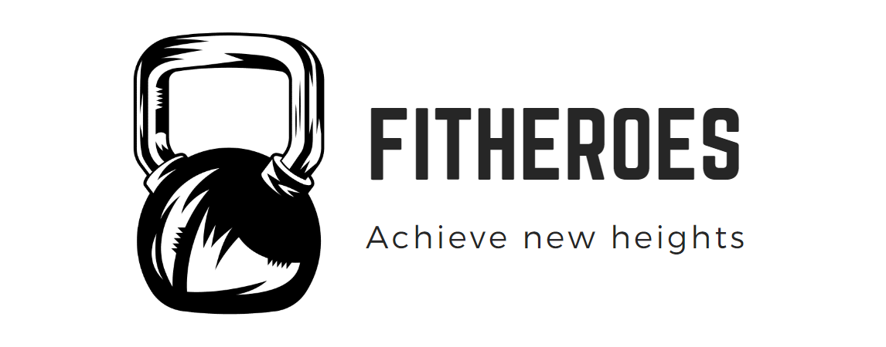

# FitHeroes

<a href="https://fitheroes.philipnguyen.dev" target="_blank" rel="noopener noreferrer">Check out the live project here!</a>

FitHeroes is a powerful fitness app that helps you track your progress, plan your workouts, and achieve your fitness goals. It provides a variety of features including a detailed calorie calculator, weight and body fat tracker, nutrition and exercise journals, and the ability to build, view, and save workout plans.

## Technologies Used

- Next.js 13: A React framework for building server-side rendered and statically generated web applications.
- PlanetScale: A cloud-native database built on MySQL for scaling applications seamlessly.
- Tailwind CSS: A utility-first CSS framework for rapidly styling user interfaces.
- Zod: A runtime type checking library for creating type-safe schemas.
- Prisma: A modern database toolkit for Node.js and TypeScript.

## Features

- **Calorie Calculator**: Easily calculate your daily caloric intake based on your goals and activity level.
- **Weight and Body Fat Tracker**: Track your weight and body fat percentage over time to monitor your progress.
- **Nutrition and Exercise Journals**: Log your meals and workouts to maintain a record of your daily activities.
- **Workout Plans**: Create personalized workout plans, view plans created by other users, and save plans for future use.
- **Plan Reviews**: Write and read reviews for workout plans to gain insights and make informed decisions.